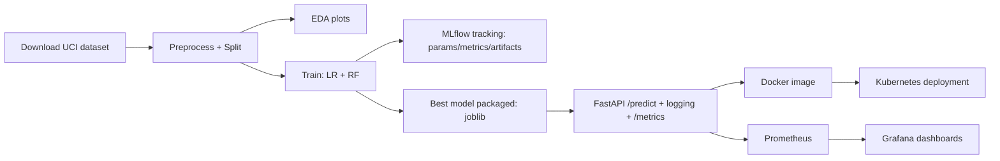

# Architecture

```mermaid
flowchart LR
  A[Download UCI dataset] --> B[Preprocess + Split]
  B --> C[EDA plots]
  B --> D[Train: LR + RF]
  D --> E[MLflow tracking: params/metrics/artifacts]
  D --> F[Best model packaged: joblib]
  F --> G[FastAPI /predict + logging + /metrics]
  G --> H[Docker image]
  H --> I[Kubernetes deployment]
  G --> J[Prometheus]
  J --> K[Grafana dashboards]
```
